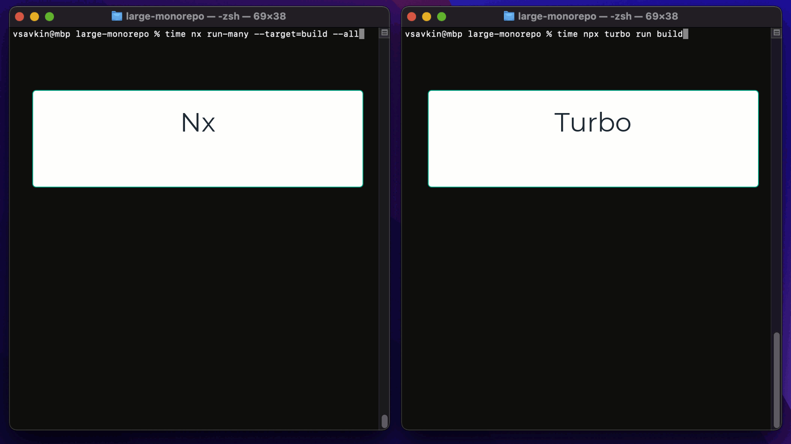
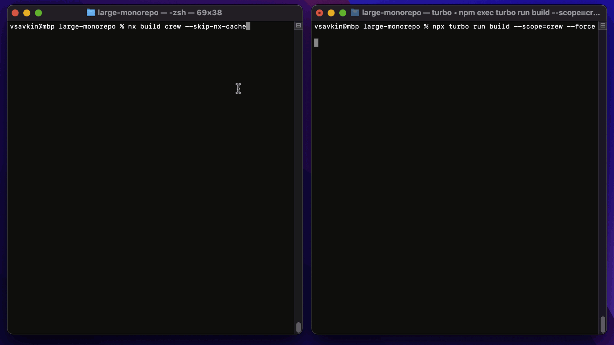

# Benchmarking Nx, Turbo, and Lage

Recording:

Repo contains:

1. 5 shared buildable packages/libraries with 250 components each
2. 5 Next.js applications built out of 20 app-specific libraries. Each app-specific lib has 250 components each. Each
   library uses the shared components.

Combined there are about 26k components. It's a lot of components, but they are very small. This corresponds to a medium
size enterprise repo. A lot of our clients have repos that are 10x bigger than this, so this repo isn't something out or
ordinary. And, the bigger the repo, the bigger the difference in performance between Nx and Turbo.

The repo has Nx, Turbo, and Lage enabled. They don't affect each other. You can remove one without affecting the
other one.

## Bencharmk & Results (Dec 04)

`npm run benchmark` runs the benchmark. The following numbers produced by an M1Max MBP on macOS 13 (Ventura). On a Windows machine all the tools will get slower, and the delta between Nx and Turbo/Lage will get bigger.

- **average lage time is: 1183.9**
- **average turbo time is: 1153.8**
- **average nx time is: 166.83**
- **nx 7.1x faster than lage**
- **nx is 6.9x faster than turbo**

### No daemon

Another performance mark that we're going to start tracking is commands run without their respective daemon. This would represent running the tools in an CI environment.
These can be run with `npm run benchmark-no-daemon`

- average lage time is: 1169.6
- average turbo time is: 1197.3
- average nx time is: 1195.1

#### Benchmark & Results June 28

- average nx time is: 142.7
- average turbo time is: 900.6
- average lage time is: 1378.4
- nx is 6.31x faster than turbo
- nx is 9.66x faster than lage

##### No daemon

- average nx time is: 1258.2
- average turbo time is: 1285.6
- average lage time is: 1213.5

#### Numbers from May 31 (M1 Pro Ventura):

- average nx time is: 149.3
- average turbo time is: 907.3
- average lage time is: 1084.4

#### Numbers from May 19:

- average nx time is: 172.8
- average turbo time is: 1134.1
- average lage time is: 1109.9

### Why is Nx faster than Turbo

Nx uses several optimizations to minimize the amount of computation required. For instance, it stores information about
the repository on disk to be able to recompute only what is needed. It runs a daemon process that gets all the necessary
data structures ready before the developer invokes a command. And the data structures are updated incrementally, usually
in just a few milliseconds.

Is Nx always faster? No. The performance sensitive parts of Nx are written in Rust, but it is all wrapped into a Node.js
process. Loading Node.js takes about 70ms (on a mac), regardless of what you do. You build 1000 projects, takes 70ms.
You build 1 project, it takes 70ms. If you have a repo with say 10 files in it, running Turbo will likely be faster
because it boots faster.

Yarn, npm, pnpm have a similar boot time to Nx, and folks don't mind. And, of course, it's worth asking whether a
high-performance build tool is even required for a repo with 10 files in it.

### Does this performance difference matter in practice?

The cache restoration Turborepo provides is likely to be fast enough for a lot of small and mid-size repos.
What matters more is the ability to distribute any command across say 50 machines while
preserving the dev ergonomics of running it on a single machine. Nx can do it. Bazel can do it (which Nx
borrows some ideas from). Turbo can't. This is where the perf gains are for larger repos.
See [this benchmark](https://github.com/vsavkin/interstellar) to learn more.

## Dev ergonomics & Staying out of your way

When some folks compare Nx and Turborepo, they say something like "Nx may do all of those things well, and may be
faster, but Turbo is built to stay out of you way". Let's talk about staying out of your way:

Run `nx build crew --skip-nx-cache` and `turbo run build --scope=crew --force`:

Nx doesn't change your terminal output. Spinners, animations, colors are the same whether you use Nx or not (we
instrument Node.js to get this result). What is also important is that when you restore things from cache, Nx will
replay the terminal output identical to the one you would have had you run the command.

Examine Turbo's output: no spinners, no animations, no colors. Pretty much anything you run with Turbo looks different (
and a lot worse, to be honest) from running the same command without Turbo.

A lot of Nx users don't even know they use Nx, or even what Nx is. Things they run look the same, they just got faster.

## Lerna and Nx

Lerna 5.1 adds the ability to use Nx for task orchestration and computation caching (in addition to `p-map` and `p-queue`, which it had before).
Given that Lerna uses Nx to run tasks, unsurprisingly, the numbers for
Lerna and Nx will be very similar--it's the same powerful task orchestrator under the hood. This also means that Lerna supports
distributed tasks execution (see above) and that it captures terminal output correctly.

## Found an issue? Send a PR.

If you find any issue with the repo, with the benchmark or the setup, please send a PR. The intention isn't to cherry
pick some example where Turbo doesn't do well because of some weird edge case. If it happens that the repo surfaces some
edge case with how turbo works, send a PR, and let's fix it. We tried to select the setup that Turbo should handle
well (e.g., Next.js apps). The repo doesn't use any incrementality which Nx is very good at. We did our best to make it
fair.
